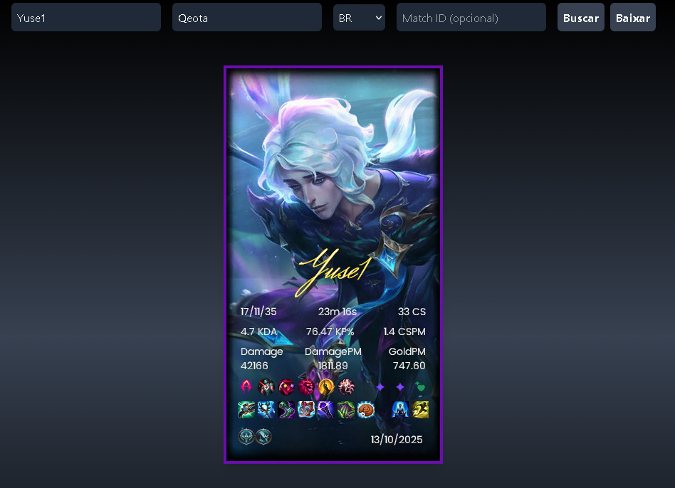

# LOL Card Match API


[](https://nodejs.org/) [](https://expressjs.com/) [](https://axios-http.com/)


Monte sua carta usando dados de uma partida de League of Legends. É necessário apenas o Nickname (Riot ID), o Tagline e o seu Servidor. Caso queira criar uma carta de uma partida antiga, é possível ao informar o GameID da partida (isso fica disponível no histórico de partidas do client)

--- 


### Pré-requisitos

* Node.js (recomenda-se v18+)
* npm

### Instalação

Clone o repositório e instalar dependências:

```bash
git clone https://github.com/martinsevandro/lolapi.git
cd lolapi
npm install
```

---

### Configuração do .env

Crie um arquivo .env na raiz do projeto com as seguintes variáveis:
```bash
PORT=3001
API_KEY=sua_chave_da_riot
```
* PORT: porta que o servidor vai usar (padrão 3001)
* API_KEY: chave de API válida da Riot Games (é possível obter uma de 24h rapidamente)

---

### Rodando o projeto
```bash
npm start
```

O servidor vai rodar em http://localhost:3001.

Certifique-se de que o frontend (descomentar no index.html) está apontando para o backend corretamente:
```bash
<script>
  window.BACKEND_URL = 'http://localhost:3001';
</script>
```

---

### Testando

* Abra o frontend no navegador (index.html).
* Preencha os campos de riotId, tagline e servidor.
* Clique em buscar para verificar se os cards e imagens carregam corretamente.

---

### Resultado
Aqui está um exemplo de card que o projeto gera a partir de dados de uma partida real.



### Mais informações
Leia mais sobre o projeto neste post: [Meu post sobre o LOL Card Match API](https://martinsevandro.github.io/posts/second-post/)
